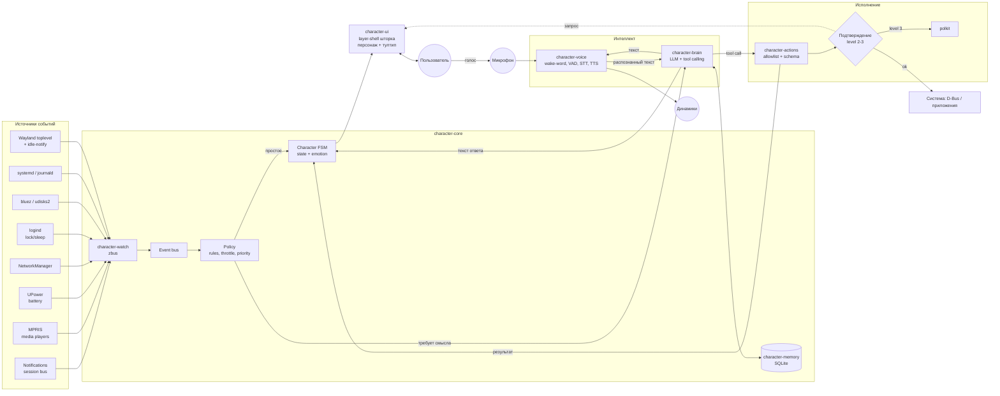
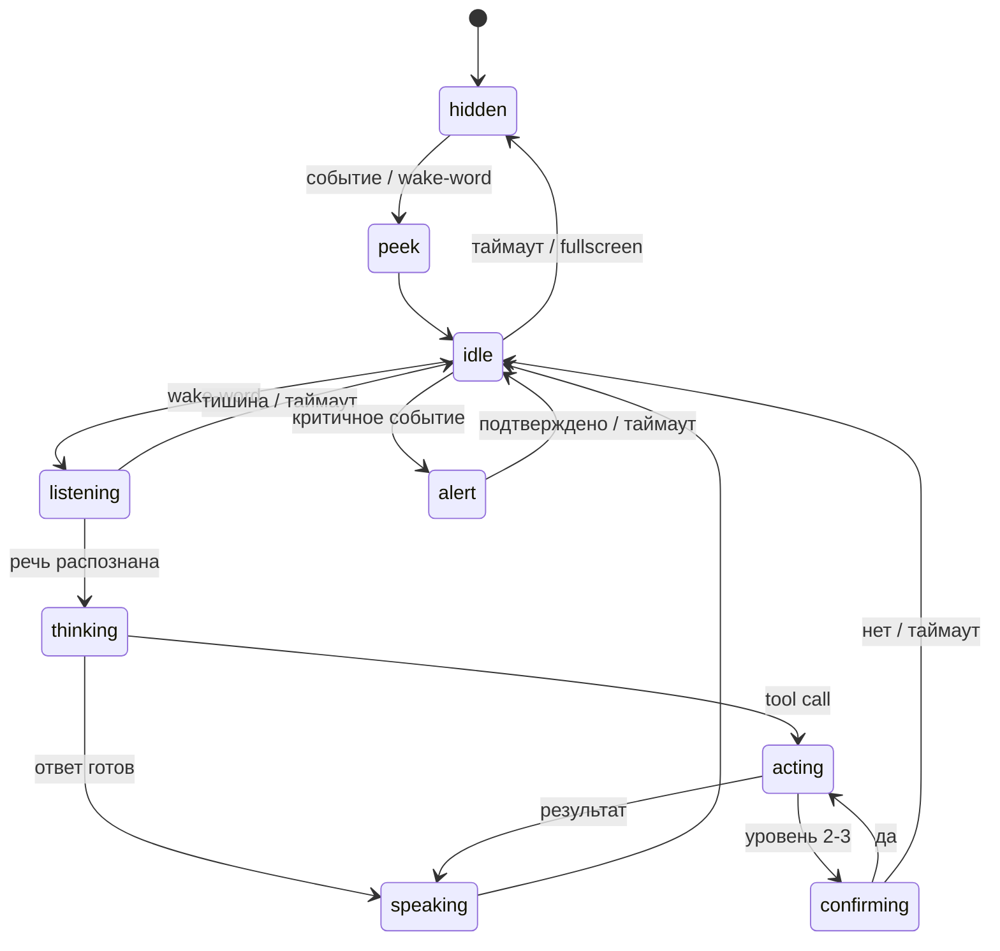
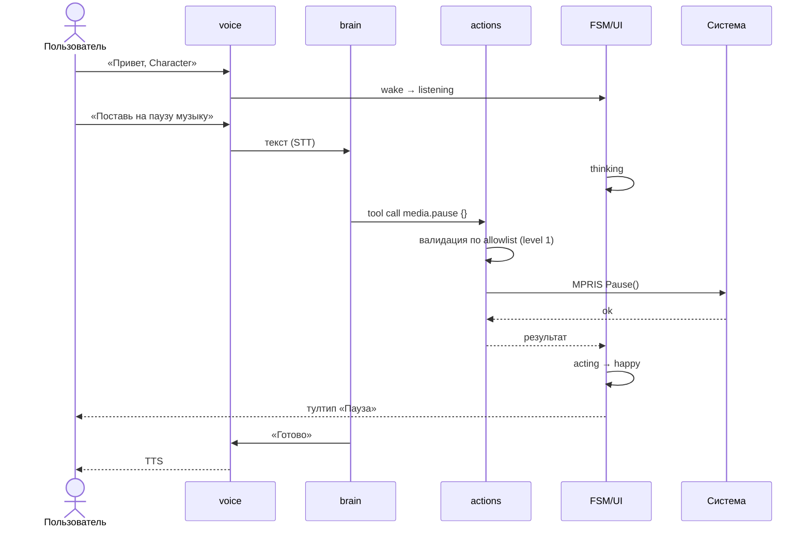
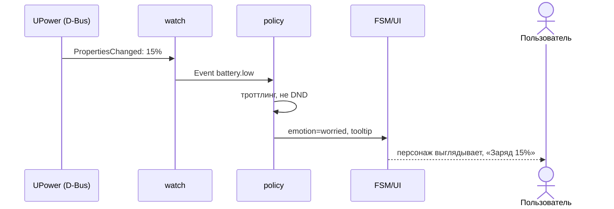

# Диаграммы Character

## 1. Связи компонентов

```mermaid
flowchart LR
  subgraph Sources[Источники событий]
    N[Notifications<br/>session bus]
    M[MPRIS<br/>media players]
    P[UPower<br/>battery]
    NM[NetworkManager]
    L[logind<br/>lock/sleep]
    B[bluez / udisks2]
    S[systemd / journald]
    W[Wayland toplevel<br/>+ idle-notify]
  end

  subgraph Daemon[character-core]
    WATCH[character-watch<br/>zbus]
    BUS[Event bus]
    POL[Policy<br/>rules, throttle, priority]
    FSM[Character FSM<br/>state + emotion]
    MEM[(character-memory<br/>SQLite)]
  end

  subgraph AI[Интеллект]
    BRAIN[character-brain<br/>LLM + tool calling]
    VOICE[character-voice<br/>wake-word, VAD, STT, TTS]
  end

  subgraph Exec[Исполнение]
    ACT[character-actions<br/>allowlist + schema]
    CONF{Подтверждение<br/>level 2-3}
    POLKIT[polkit]
  end

  UI[character-ui<br/>layer-shell шторка<br/>персонаж + тултип]
  MIC((Микрофон))
  SPK((Динамики))
  USER((Пользователь))

  N & M & P & NM & L & B & S & W --> WATCH --> BUS --> POL
  POL -- простое --> FSM
  POL -- требует смысла --> BRAIN
  BRAIN <--> MEM
  BRAIN -- tool call --> ACT
  ACT --> CONF
  CONF -- level 3 --> POLKIT
  CONF -- ok --> SYS[Система: D-Bus / приложения]
  CONF -. запрос .-> UI
  ACT -- результат --> FSM
  BRAIN -- текст ответа --> FSM
  FSM --> UI
  BRAIN -- текст --> VOICE
  MIC --> VOICE -- распознанный текст --> BRAIN
  VOICE --> SPK
  UI <--> USER
  USER -- голос --> MIC
```

## 2. Состояния персонажа

```mermaid
stateDiagram-v2
  [*] --> hidden
  hidden --> peek: событие / wake-word
  peek --> idle
  idle --> listening: wake-word
  listening --> thinking: речь распознана
  listening --> idle: тишина / таймаут
  thinking --> speaking: ответ готов
  thinking --> acting: tool call
  acting --> speaking: результат
  acting --> confirming: уровень 2-3
  confirming --> acting: да
  confirming --> idle: нет / таймаут
  speaking --> idle
  idle --> alert: критичное событие
  alert --> idle: подтверждено / таймаут
  idle --> hidden: таймаут / fullscreen
```

## 3. Голосовой диалог с действием

```mermaid
sequenceDiagram
  actor U as Пользователь
  participant V as voice
  participant B as brain
  participant A as actions
  participant F as FSM/UI
  participant S as Система

  U->>V: «Привет, Character»
  V->>F: wake → listening
  U->>V: «Поставь на паузу музыку»
  V->>B: текст (STT)
  F->>F: thinking
  B->>A: tool call media.pause {}
  A->>A: валидация по allowlist (level 1)
  A->>S: MPRIS Pause()
  S-->>A: ok
  A-->>F: результат
  F->>F: acting → happy
  F-->>U: тултип «Пауза»
  B->>V: «Готово»
  V-->>U: TTS
```

## 4. Реакция на событие (без LLM)

```mermaid
sequenceDiagram
  participant D as UPower (D-Bus)
  participant W as watch
  participant P as policy
  participant F as FSM/UI
  actor U as Пользователь

  D->>W: PropertiesChanged: 15%
  W->>P: Event battery.low
  P->>P: троттлинг, не DND
  P->>F: emotion=worried, tooltip
  F-->>U: персонаж выглядывает, «Заряд 15%»
```
